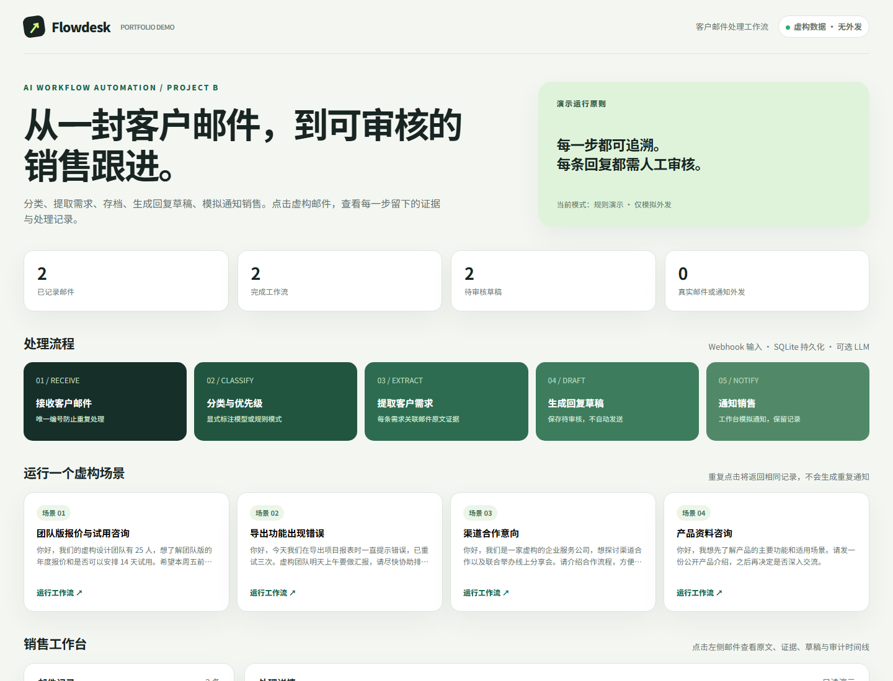
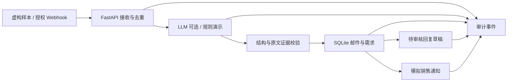

# Flowdesk · AI 工作流自动化 B

一个可运行、可演示、可审计的中文客户邮件工作流作品集。它把**虚构**客户邮件转成分类与优先级、带原文证据的需求、数据库记录、待人工审核的回复草稿，以及销售工作台中的**模拟通知**。系统没有连接真实邮箱，也没有任何真实外发能力。



**当前交付状态（2026-10-06）：** 本地 Docker 已验证，广州服务器独立服务已运行并完成四个虚构场景；腾讯云防火墙已放行 TCP 8766，公网演示页面与 API 已从服务器外部验收。打开 [在线演示](http://139.199.90.153:8766/)；详情与回退证据见 [VERIFICATION.md](VERIFICATION.md)。当前地址仅提供 IP/HTTP，限虚构样本演示。

## 亲自体验

需要 Docker Desktop。在本目录执行：

```powershell
docker compose up --build -d
```

打开 <http://127.0.0.1:8766/>，点击任意“运行工作流”样本。页面会展示邮件原文、分类、需求及原文证据、回复草稿、模拟销售通知和审计时间线。再次点击同一场景会返回原记录，不会生成第二条通知。API 文档在 <http://127.0.0.1:8766/docs>。

停止：`docker compose down`。SQLite 数据保存在 Docker volume 中；`docker compose down -v` 会删除演示记录。

也可用 Python 3.11+：安装 `requirements.txt`，运行 `python -m uvicorn app.main:app --port 8766`。数据默认放在当前目录 `data/`。

## 真实的技术边界

默认是**规则演示模式**：离线可完整走通工作流，但分类和草稿来自可检查的 Python 规则与模板，不能称为大模型推理。配置兼容 OpenAI 的 Chat Completions 接口后，LLM 决定类别，并从编号的邮件原句中选择客户诉求；优先级由时限关键词规则判定，系统只保存原句本身作为需求与证据，再用模板自动生成草稿。模型返回的类别、编号和诉求句都须通过校验；同时出现“报价/试用”的组合类别会按明确规则规范为报价咨询并单独标记。模型不可用或输出无效时会记录 `fallback` 审计事件，并明确标记“规则回退”。草稿始终需要人工审核。

本项目面向求职演示，不是生产客服系统。没有邮箱接入器、销售平台连接、多租户权限、人工审核后台或真实发送；`notifications.sent` 永远为 `false`。公开演示只接收仓库内四封虚构样本，拒绝任意邮件 Webhook。请勿提交真实客户信息。

## 架构



- **接收**：`message_id` 唯一约束防止重复入库；相同 ID 不同内容返回 409。
- **处理**：类别为报价咨询、产品试用、技术支持、商务合作或一般咨询；优先级为低、中、高。
- **提取**：每条需求附邮件正文中的逐字证据；LLM 虚构的证据被拒绝并触发规则回退。
- **持久化**：SQLite 保存邮件、分类、需求、草稿、模拟通知和各阶段事件。处理失败也留下失败记录。
- **展示**：只读销售工作台可查询处理记录；演示按钮只运行预置样本，每来源每分钟限 12 次。

更多设计选择见 [ARCHITECTURE.md](ARCHITECTURE.md)。

## 配置可选 LLM

复制 `.env.example` 为 `.env`，填写 `OPENAI_BASE_URL`（以 `/v1` 结束）和 `OPENAI_CHAT_MODEL`；如提供商需要，再填 `OPENAI_API_KEY`。Docker Compose 会读取 `.env`。密钥不写入仓库。模型返回 JSON：类别和选中的原句编号；代码映射回原文，按规则判定优先级并生成模板草稿。具体结构见 `app/pipeline.py`。界面及记录会显示 `LLM 分类/提取`、`规则演示` 或 `规则回退`，方便面试时清楚说明实际运行模式。

## Webhook 本地集成

公开演示默认 `DEMO_MODE=true`，任意邮件 Webhook 返回 403。要在**本地**演示任意虚构邮件接入，设置 `DEMO_MODE=false` 和随机长 `WEBHOOK_TOKEN`，重启应用，再向 `POST /api/webhook/email` 发送 JSON，HTTP 头为 `X-Webhook-Token`。字段：`message_id`、`from_name`、`from_email`、`subject`、`body`。示例请求体：

```json
{
  "message_id": "fictional-005",
  "from_name": "测试客户（虚构）",
  "from_email": "fictional@example.com",
  "subject": "试用咨询",
  "body": "你好，我们想了解产品试用流程。请提供公开说明。"
}
```

Webhook token 只保护本地集成入口；它不是完整的企业身份认证。真实邮件接入需要另做来源验证、权限和隐私设计。

## API 与测试

| 方法 | 路径 | 说明 |
| --- | --- | --- |
| GET | `/api/status` | 运行模式、记录数量、外发边界 |
| GET | `/api/samples` | 四封虚构样本 |
| POST | `/api/demo/run/{sample_id}` | 运行预置样本，重复运行返回原记录 |
| GET | `/api/emails` | 最近 100 条记录摘要 |
| GET | `/api/emails/{id}` | 邮件、需求、草稿、通知和审计事件 |
| POST | `/api/webhook/email` | 仅 `DEMO_MODE=false` 且 token 有效时可用 |

```powershell
python -m pip install -r requirements-dev.txt
python -m pytest -q
docker compose config --quiet
```

测试覆盖端到端处理、持久化、幂等、公开入口约束、Webhook 鉴权与冲突、四种场景，以及无依据的 LLM 输出拒绝。实际测试与部署结果见 [VERIFICATION.md](VERIFICATION.md)。

## 求职展示

[PORTFOLIO.md](PORTFOLIO.md) 提供 30 秒介绍、3 分钟演示顺序、可核实的简历表述和面试问答。[DEPLOYMENT.md](DEPLOYMENT.md) 记录独立服务、运维和回退方法。仓库采用 MIT 许可；虚构样本可用于演示。
